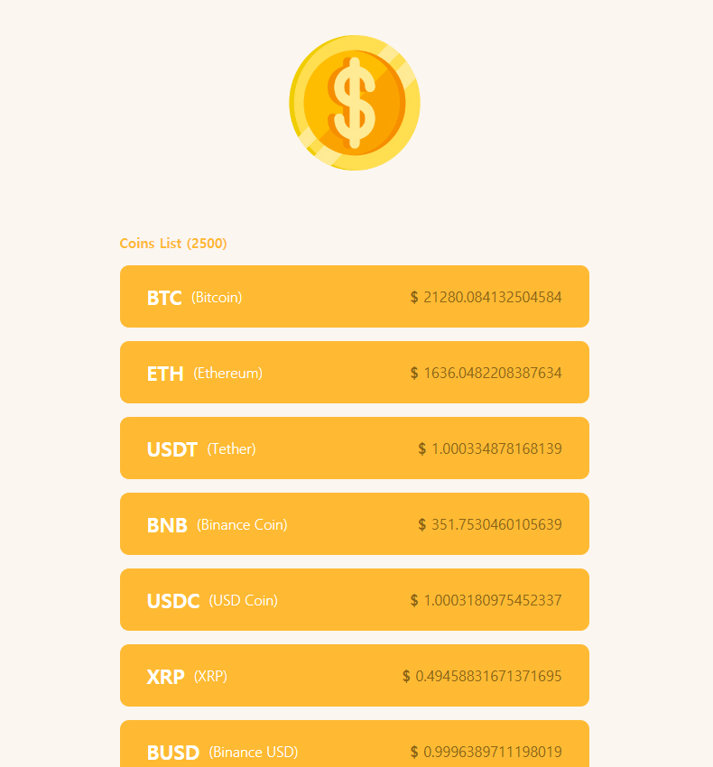

# React Practice Moive App 2022

리액트 영화 앱 만들기 연습 v2022

## **2022. 10. 31 TODO LIST 만들기**
 * useState 2개를 이용해 배열과 스프레드 문법을 이용하여 요소를 추가하기(onSubmit)
```js
const [toDo, setToDo] = useState("");
  const [list,addList] = useState([]);
  const onChangeEvent = (e) => {
    //event.target = 이벤트 대상 오브젝트(input)
    setToDo(e.target.value);
  };
  const onSubmit = (e) =>{
    e.preventDefault();
    if(toDo === "") return;
    setToDo("");
    addList((currentArray)=> [toDo, ...currentArray]);
  }
```

<br>

* map() 메서드를 이용하여 각각의 배열요소를 순회 하면서 li를 추가될 수 있도록 한다.
  1. list 추가
  2. currentItem은 각각의 요소를 가진다.
  3. index는 각 요소의 index를 가진다.
  4. key값은 필수이다.(map으로 받을수 있는 어떤 값도 가능 value || index || array)
  
```js
<ul>
    {list.map((currentItem,index)=>(
      <li key={index}>{currentItem}</li>
    ))}
</ul>
```

<br>

## **2022. 11. 05 COIN CHECK API 만들기**
fetch와 후속 메서드 then을 활용하여 데이터를 요청후 json 형태로 변환해서 코인의 이름과 가격을 리스트업 하는 간단한 페이지 제작\

> #useState #useEffect #fetch #then #props

```jsx
function App() {
  const [coins, setCoins] = useState([]);
  
  //useEffect로 한번만 불러온다.
  useEffect(() => {
    fetch("https://api.coinpaprika.com/v1/tickers")
      .then((response) => response.json())
      .then((json) => {
        setCoins(json);
      });
  }, []);
  
  //리스트에 스타일을 입히기 위해서 한번 더 컴퍼넌트화 시키고
  //props로 전달 후 map을 이용해 모든 배열을 뿌려준다.
  function CoinList({ coin }) {
    return (
      <ul className={styles.liContainer}>
        {coin.map((arr) => (
          <li>
            <strong>
              {arr.symbol}
              <span>({arr.name})</span>
            </strong>
            <span className="price">
              <em>$</em> {arr.quotes.USD.price}
            </span>
          </li>
        ))}
      </ul>
    );
  }
  return (
    <div className={styles.bodyWrap}>
      <h2 className={styles.title}>
        
      </h2>

      <div className={styles.liWrap}>
        <h3>Coins List ({coins.length})</h3>
        <CoinList coin={coins} />
      </div>
    </div>
  );
}
```

### 완성 화면




<br>

## **2022. 11. 12 MOVIE APP API 만들기**
1. async-await을 이용해 데이터를 받아와 리스트가 나오는 페이지를 만듦

```js
const getMovies = async () => {
  const response = await fetch('https://yts.mx/api/v2/list_movies.json?minimum_rating=8.8&sort_by=year');
  const json = await response.json();
}

//같은 표현
const getMovies2 = async () => {
  const response = await ((await fetch('https://yts.mx/api/v2/list_movies.json?minimum_rating=8.8&sort_by=year')).json());
}
```

2. router 사용을 위해서 컴퍼넌트 파일을 만든다.
>router는 여러페이지를 상황에 따라 한곳에서(App.js) 렌더해주는 것이라 이해 하면 된다.

<br>

```js
function App() {
  return (
          <Router>
            //switch는 하나의 Route를 렌더해준다.
            <Switch>
              //:id 로 /movie/뒤에 파라미터를 가져올 수 있다.
              <Route path="/movie/:id">
                <Detail />
              </Route>
              <Route path="/">
                <Home />
              </Route>
            </Switch>
          </Router>
  );
}
```

<br>

3. ract router에 내장돼 있는 link를 이용하면 페이지를 새로고침(리렌더) 하지않고 페이지 이동을 할 수 있다.

```js
<Link to={`/movie/${id}`}>View More</Link>
```


